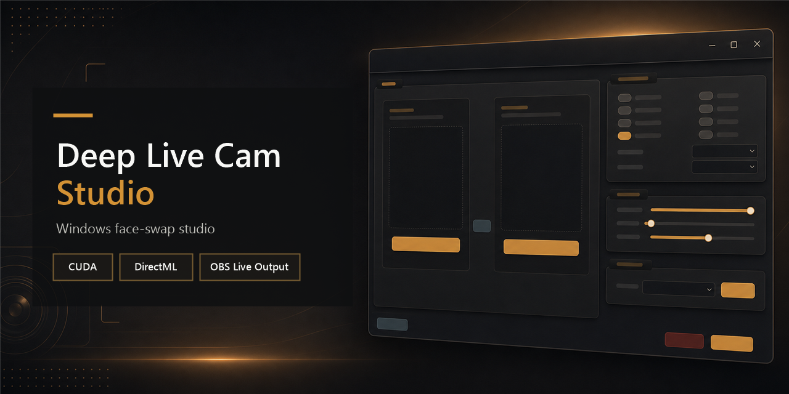

<p align="center">
  
</p>

<h1 align="center">Deep Live Cam Studio</h1>

<p align="center">
  A Windows face-swap studio for file rendering and live camera output, with
  dedicated CUDA and DirectML builds.
</p>

<p align="center">
  <a href="https://github.com/CRSD-Lau/deep-live-cam/releases/latest"></a>
</p>

<p align="center">
  <strong>NVIDIA:</strong> choose the setup <code>.exe</code> &nbsp;·&nbsp;
  <strong>AMD or Intel:</strong> choose the DirectML <code>.zip</code>
</p>

<p align="center">
  <a href="https://github.com/CRSD-Lau/deep-live-cam/releases/latest"></a>
  <a href="https://github.com/CRSD-Lau/deep-live-cam/releases"></a>
  
  <a href="https://github.com/CRSD-Lau/deep-live-cam/actions/workflows/ci.yml"></a>
  <a href="https://github.com/CRSD-Lau/deep-live-cam/security"></a>
  <a href="LICENSE"></a>
</p>

<p align="center">
  <a href="#download">Download</a> ·
  <a href="#quick-start">Quick start</a> ·
  <a href="#features">Features</a> ·
  <a href="#documentation">Documentation</a> ·
  <a href="CONTRIBUTING.md">Contribute</a> ·
  <a href="SECURITY.md">Security</a>
</p>



> [!IMPORTANT]
> Select **Download for Windows** above, then expand **Assets** if necessary. Do not use the green **Code** button—its source archives do not install the application.

> [!CAUTION]
> Use face-swap software only with consent and for lawful purposes. Do not use it for impersonation, fraud, harassment, non-consensual sexual content, or misleading media.

## Download

Open the [latest release](https://github.com/CRSD-Lau/deep-live-cam/releases/latest), expand **Assets**, and choose the build that matches your hardware:

| Hardware | Download | Packaging |
| --- | --- | --- |
| NVIDIA GPU | `DeepLiveCamStudio-<version>-x64-setup.exe` | Per-user Windows installer with CUDA runtime support |
| AMD or Intel GPU | `DeepLiveCamStudio-<version>-DirectML-x64-portable.zip` | Extract-and-run DirectML package |
| Developers | Corresponding-source archive | Exact source and packaging scripts for the release |

DirectML also works on supported NVIDIA GPUs, but CUDA is the recommended NVIDIA profile.

Release assets include SHA-256 sidecars and a combined `SHA256SUMS.txt`. Windows may show Microsoft Defender SmartScreen because the public installer does not yet have paid code-signing reputation. Proceed only when the file came from this repository and its checksum matches the release page.

### Updating

- **NVIDIA/CUDA installer:** Close Deep Live Cam Studio and run the newer setup
  `.exe`. It replaces the registered installation, migrates older version-named
  install folders to one stable location, and keeps downloaded models,
  settings, and logs.
- **AMD/Intel DirectML portable:** Close the app and extract the newer ZIP into
  a new folder. After it starts successfully, delete the previous extracted
  folder. Models, settings, and logs remain under
  `%LOCALAPPDATA%\DeepLiveCamStudio`.

Do not extract the DirectML package over the CUDA installation or mix files
from the two packages.

## Features

| Capability | What it provides |
| --- | --- |
| Windows desktop studio | A native PySide6 interface for source selection, preview, rendering, refinement, and live output. |
| NVIDIA acceleration | A packaged CUDA installer with the reviewed runtime libraries required by ONNX Runtime GPU. |
| AMD and Intel acceleration | A separate DirectML portable build for DirectX 12-capable Windows GPUs. |
| OBS and virtual cameras | Process a camera feed and send it to OBS, meeting apps, or other virtual-camera consumers. |
| Consent-based model setup | Models are excluded from releases and downloaded only after the user reviews their source, licence notes, and checksums. |
| Reproducible releases | Versioned dependency locks, SHA-256 sidecars, corresponding-source archives, and automated release checks. |

## Quick Start

1. Download the CUDA installer for NVIDIA or the DirectML ZIP for AMD/Intel.
2. Run the NVIDIA installer, or extract the DirectML ZIP into a new folder.
3. Start **Deep Live Cam Studio**.
4. Select **Set Up Models** and review the model sources, licence notes, and checksums.
5. Select a source face and target image, video, or camera.
6. Use **Preview**, **Start Render**, or **Start Live**.


Video processing requires `ffmpeg` and `ffprobe`:

```powershell
winget install Gyan.FFmpeg
```

Close and reopen the app after installation so the new commands are available.

## Requirements

| Requirement | Notes |
| --- | --- |
| Operating system | 64-bit Windows 10 22H2, Windows 11 23H2, or newer |
| NVIDIA profile | Supported NVIDIA GPU and a current production driver |
| DirectML profile | AMD, Intel, or NVIDIA DirectX 12-capable GPU with a current vendor driver |
| Video files | `ffmpeg` and `ffprobe` on `PATH` |
| Live output | Camera access and an installed virtual-camera consumer such as OBS |
| Models | Downloaded separately with explicit consent; not bundled in releases |

See [DirectML testing](docs/DIRECTML_TESTING.md) and [OBS Virtual Camera](docs/OBS_VIRTUAL_CAMERA.md) for provider-specific setup and troubleshooting.

## Using the Studio


### Files

Choose a source face and target image or video. Video previews start automatically; use **Play**/**Pause** or the timeline to inspect individual frames. Adjust the quality and refinement controls, then select **Start Render**. Video output retains audio when `ffmpeg` is available and **Keep audio** is enabled.

### Live Output

Select a camera, configure the processing options, and choose **Start Live**. The processed feed can be consumed by OBS or another virtual-camera application. Stop live output before changing providers or closing the app.

### Command Line

The packaged app includes a diagnostic and automation CLI:

```powershell
DeepLiveCamStudioCLI.exe --check-execution-provider --execution-provider cuda
DeepLiveCamStudioCLI.exe --source source.png --target target.png --output output.png --execution-provider cuda
```

DirectML users can select a particular adapter:

```powershell
DeepLiveCamStudioCLI.exe --check-execution-provider --execution-provider directml --directml-device-id 0
```

Provider checks fail when the requested accelerator is unavailable instead of silently treating CPU fallback as success.

## Models and Privacy

- Face-swap and enhancement models are not bundled with the installer or portable archive.
- Model downloads require explicit consent and are checked against reviewed SHA-256 values.
- Media stays on the local machine unless the user moves or shares it.
- Treat faces, media files, third-party models, and logs as sensitive or untrusted input.
- Never attach private faces, videos, credentials, or model binaries to a public GitHub issue.

Model sources and redistribution constraints are documented in [the model licence audit](LICENSES/MODEL_LICENSE_AUDIT.md).

## Documentation

Start with the [documentation index](docs/README.md).

### Users

- [DirectML setup and provider verification](docs/DIRECTML_TESTING.md)
- [OBS and virtual-camera setup](docs/OBS_VIRTUAL_CAMERA.md)
- [Support and troubleshooting routes](SUPPORT.md)
- [Security policy](SECURITY.md)

### Developers and Maintainers

- [Build from source](docs/BUILDING.md)
- [Dependency locks and supported runtime matrix](docs/DEPENDENCY_LOCKS.md)
- [Contribution guide](CONTRIBUTING.md)
- [Release checklist](RELEASE_CHECKLIST.md)
- [Governance and maintenance policy](GOVERNANCE.md)
- [Licence and release compliance](COMPLIANCE.md)

## Build From Source

Use Python 3.11 on Windows. The CUDA and DirectML profiles are intentionally isolated because their ONNX Runtime packages conflict.

```powershell
py -3.11 -m venv venv
venv\Scripts\python.exe -m pip install -r requirements.txt -r requirements-dev.txt
venv\Scripts\python.exe run.py --execution-provider cuda
```

For DirectML, packaged builds, tests, and release commands, follow [docs/BUILDING.md](docs/BUILDING.md).

## Security and Release Integrity

- Report vulnerabilities through [GitHub private vulnerability reporting](https://github.com/CRSD-Lau/deep-live-cam/security/advisories/new), never a public issue.
- Download only from this repository's release page.
- Verify release hashes before installing on a sensitive system.
- Public binary releases include the corresponding source and licence evidence required by AGPL-3.0.

See [SECURITY.md](SECURITY.md) for supported versions, response targets, and reporting guidance.

## Contributing

Issues and pull requests are welcome when they are reproducible, scoped, and safe. Hardware-facing changes must distinguish automated provider checks from physical CUDA/DirectML/OBS validation.

Read [CONTRIBUTING.md](CONTRIBUTING.md) and the [Code of Conduct](CODE_OF_CONDUCT.md) before contributing. Use [GitHub Discussions](https://github.com/CRSD-Lau/deep-live-cam/discussions) for questions and ideas; use issues for confirmed bugs and planned work.

## Project Scope and Attribution

This repository is a Windows-focused derivative of [hacksider/Deep-Live-Cam](https://github.com/hacksider/Deep-Live-Cam). It prioritizes packaged Windows releases, reproducible dependency profiles, hardware-provider validation, and OBS live output. Upstream history and contributors remain part of the project history.

## Licence and Compliance

The application is licensed under [GNU AGPL-3.0](LICENSE). Model files and third-party components may have separate terms. Anyone distributing a modified binary must provide the complete corresponding source for that binary and preserve applicable notices.

Review [COMPLIANCE.md](COMPLIANCE.md), [THIRD_PARTY_NOTICES.md](THIRD_PARTY_NOTICES.md), and the [licence evidence index](LICENSES/README.md) before redistributing the application.
