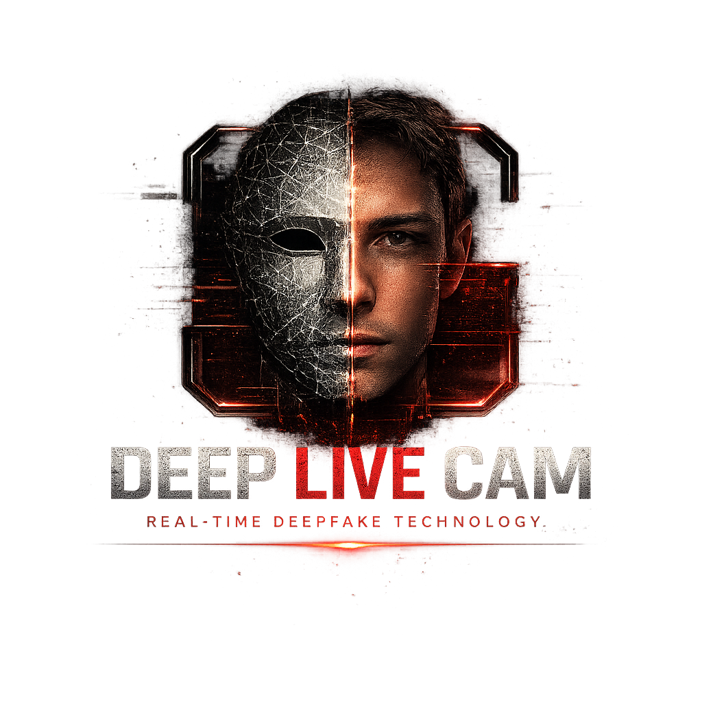

<p align="center">
  
</p>

<h1 align="center">Deep Live Cam Studio</h1>

<p align="center">
  Windows-focused Deep-Live-Cam build with a packaged installer, in-app model setup, CUDA and DirectML runtime profiles, and OBS virtual-camera workflow docs.
</p>

<p align="center">
  <a href="https://github.com/CRSD-Lau/deep-live-cam/releases/tag/v2.2.0">
    
  </a>
  
  
  
  <a href="https://github.com/CRSD-Lau/deep-live-cam/actions/workflows/ci.yml">
    
  </a>
</p>

<p align="center">
  <a href="#download">Download</a> ·
  <a href="#quick-start">Quick Start</a> ·
  <a href="#model-setup">Models</a> ·
  <a href="#obs-and-virtual-camera">OBS</a> ·
  <a href="#build-from-source">Build</a> ·
  <a href="#license-and-compliance">Compliance</a>
</p>


> [!IMPORTANT]
> Download the NVIDIA installer or AMD/Intel DirectML portable build from the GitHub Release page, not from the green **Code** button. Source archives are for developers and do not install the app.

> [!WARNING]
> The installer does not include face-swap model files. After installing, open the app and click **Set Up Models** so you can review model sources, license notes, and checksums before download.

<details>
<summary>Table of contents</summary>

- [Download](#download)
- [Quick Start](#quick-start)
- [What The Downloads Include](#what-the-downloads-include)
- [Latest Release](#latest-release)
- [Install And Update](#install-and-update)
- [Windows Runtime Notes](#windows-runtime-notes)
- [Model Setup](#model-setup)
- [Usage](#usage)
- [OBS And Virtual Camera](#obs-and-virtual-camera)
- [Build From Source](#build-from-source)
- [Build The Windows Installer](#build-the-windows-installer)
- [Signing](#signing)
- [Release Process](#release-process)
- [Safety And Responsible Use](#safety-and-responsible-use)
- [Security](#security)
- [Contributing](#contributing)
- [Upstream Attribution](#upstream-attribution)
- [License And Compliance](#license-and-compliance)

</details>

## Download

Current release:

[Deep Live Cam Studio 2.2.0](https://github.com/CRSD-Lau/deep-live-cam/releases/tag/v2.2.0)

Choose the build for your GPU:

- **NVIDIA (CUDA) installer:** [DeepLiveCamStudio-2.2.0-x64-setup.exe](https://github.com/CRSD-Lau/deep-live-cam/releases/download/v2.2.0/DeepLiveCamStudio-2.2.0-x64-setup.exe)
- **AMD/Intel (DirectML) portable:** [DeepLiveCamStudio-2.2.0-DirectML-x64-portable.zip](https://github.com/CRSD-Lau/deep-live-cam/releases/download/v2.2.0/DeepLiveCamStudio-2.2.0-DirectML-x64-portable.zip)

The DirectML build also works on DirectX 12-capable NVIDIA GPUs, but CUDA remains the recommended NVIDIA option.

On the release page, expand **Assets** and choose one of:

```text
DeepLiveCamStudio-2.2.0-x64-setup.exe
DeepLiveCamStudio-2.2.0-DirectML-x64-portable.zip
```

Windows may show Microsoft Defender SmartScreen because the public installer is not signed by a paid code-signing certificate. Choose **More info** and then **Run anyway** only if the file came from the release link above.

## Quick Start

1. Download the CUDA installer for NVIDIA, or the DirectML ZIP for AMD/Intel.
2. Run the installer, or unzip the DirectML package into a new folder.
3. Open **Deep Live Cam Studio** from the Start Menu or extracted folder.
4. Click **Set Up Models** in the app header.
5. Follow the model source, license, and checksum prompts.

That is enough for the installed app and required face-swap model setup.


For video files, install `ffmpeg` and `ffprobe`:

```powershell
winget install Gyan.FFmpeg
```


Close and reopen Deep Live Cam Studio after installing FFmpeg. OBS Virtual Camera is optional and only needed when sending live output into Discord, Zoom, Teams, OBS, or similar apps.

## What The Downloads Include

| Included in both downloads | Installer only | Not included |
| --- | --- | --- |
| Deep Live Cam Studio desktop app | Start Menu and optional desktop shortcuts | Face-swap model/checkpoint files |
| Packaged Python runtime and app dependencies | Per-user install/uninstall | `ffmpeg` and `ffprobe` |
| CLI diagnostics and model setup | CUDA 12/cuDNN 9 runtime for NVIDIA | OBS Virtual Camera |
| GPU profile matching the download | Versioned installed folder | Paid code-signing reputation |

## Latest Release

Version `2.2.0` adds:

- A verified DirectML build for AMD and Intel DirectX 12 GPUs.
- Stable Radeon processing by keeping face analysis on CPU while face swapping and enhancement use DirectML.
- Strict provider checks and DirectML adapter selection for multi-GPU systems.
- A fix for Preview/Start Render re-entry that could freeze both CUDA and DirectML builds.
- Complete portable packaging of hidden runtime dependencies required by scikit-learn.
- Hardware validation on a Radeon 6900 XT and an NVIDIA RTX 4070, including Live Output.

## Install And Update

Default install path:

```text
%LOCALAPPDATA%\Programs\DeepLiveCamStudio\2.2.0
```

Model storage:

```text
%LOCALAPPDATA%\DeepLiveCamStudio\models
```

Updates install into a new versioned folder. You do not need to uninstall the previous version first. Once the new version is working, older versions can be removed from Windows Installed Apps.

## Windows Runtime Notes

- CUDA acceleration requires compatible NVIDIA drivers.
- The installer bundles the CUDA 12/cuDNN 9 runtime DLLs needed by `onnxruntime-gpu`.
- The installer contains CUDA and CPU providers for NVIDIA systems.
- The separate DirectML release ZIP supports AMD and Intel GPUs. Face analysis runs on CPU for compatibility while the heavier swap and enhancement models remain GPU-accelerated.
- Provider checks fail instead of silently claiming success after an unintended CPU fallback.
- `ffmpeg` and `ffprobe` are required for video processing and audio restore.
- OBS Virtual Camera is optional and must be installed/configured through OBS.
- Desktop launch logs are written to `%LOCALAPPDATA%\DeepLiveCamStudio\logs`.
- UI switch state is written to `%LOCALAPPDATA%\DeepLiveCamStudio\switch_states.json`.

## Model Setup

From the installed app, click **Set Up Models** in the header.

For terminal setup, open a shell in the installed app folder and run:

```powershell
DeepLiveCamStudioCLI.exe --download-models
```

From a source checkout:

```powershell
python run.py --download-models
```

Use `DLC_MODELS_DIR` to point the app at a different reviewed model folder.

> [!CAUTION]
> Do not upload model binaries to GitHub Releases unless redistribution rights are confirmed for every model file.

## Usage

Launch the desktop app from the Start Menu or installed folder.

For CLI processing:

```powershell
DeepLiveCamStudioCLI.exe --source source.png --target target.png --output output.png --execution-provider cuda
```

For source checkout usage:

```powershell
python run.py --execution-provider cuda
```

Useful CLI flags:

```text
--download-models
--execution-provider cuda
--execution-provider cpu
--execution-provider directml
--directml-device-id 0
--check-execution-provider
--virtual-cam
--camera-width 1280
--camera-height 720
--camera-fps 60
--virtual-cam-width 1920
--virtual-cam-height 1080
--virtual-cam-fps 60
```

## OBS And Virtual Camera

Deep Live Cam Studio can send processed live output directly to a virtual camera:

```powershell
python run.py --execution-provider cuda --virtual-cam
```

Example 720p60 processing with 1080p60 virtual-camera output:

```powershell
python run.py --execution-provider cuda --virtual-cam --camera-width 1280 --camera-height 720 --camera-fps 60 --virtual-cam-width 1920 --virtual-cam-height 1080 --virtual-cam-fps 60
```

OBS's built-in virtual camera is a single device. Use direct virtual-camera output for Discord, Zoom, or Teams, or use OBS Window Capture on the `Deep-Live-Cam Live Preview` window when OBS needs to rebroadcast the scene.

See [docs/OBS_VIRTUAL_CAMERA.md](docs/OBS_VIRTUAL_CAMERA.md) for setup and troubleshooting.

## Build From Source

Recommended Windows setup:

```powershell
python -m venv venv
venv\Scripts\activate
pip install -r requirements.txt
```

For CUDA source runs:

```powershell
pip install -U torch torchvision torchaudio --index-url https://download.pytorch.org/whl/cu128
pip uninstall onnxruntime onnxruntime-gpu
pip install onnxruntime-gpu==1.23.2
python tools/check_cuda_provider.py --execution-provider cuda --strict
```

For AMD or Intel GPUs on Windows, create the isolated DirectML environment:

```powershell
powershell -ExecutionPolicy Bypass -File tools\setup_directml.ps1
run-directml.bat
```

Validate a particular Windows GPU adapter without opening the UI:

```powershell
.venv-directml\Scripts\python.exe run.py --execution-provider directml --directml-device-id 0 --check-execution-provider
```

DirectML and CUDA use mutually exclusive ONNX Runtime Python packages, so the
setup script deliberately keeps DirectML in `.venv-directml` instead of
overwriting the normal CUDA environment. See
[`docs/DIRECTML_TESTING.md`](docs/DIRECTML_TESTING.md) for DirectML setup,
provider verification, and troubleshooting.

Run from source:

```powershell
python run.py --download-models
python run.py --execution-provider cuda
```

## Build The Windows Installer

Build the PyInstaller bundle:

```powershell
powershell -ExecutionPolicy Bypass -File build\windows\build_windows.ps1
```

Build and package the portable DirectML release:

```powershell
powershell -ExecutionPolicy Bypass -File build\windows\build_windows.ps1 -Accelerator DirectML
powershell -ExecutionPolicy Bypass -File build\windows\package_portable.ps1 -AppVersion 2.2.0 -Accelerator DirectML
```

The DirectML bundle is built under `dist\DeepLiveCamStudio-DirectML`; the
release ZIP and SHA-256 sidecar are written under `build\windows\portable`.

Run local preflight checks:

```powershell
powershell -ExecutionPolicy Bypass -File build\windows\test_packaged_runtime.ps1
powershell -ExecutionPolicy Bypass -File build\windows\test_environment.ps1
```

Package the installer:

```powershell
powershell -ExecutionPolicy Bypass -File build\windows\package_installer.ps1 -AppVersion 2.2.0
```

Installer output:

```text
build\windows\installer\DeepLiveCamStudio-2.2.0-x64-setup.exe
```

## Signing

For a real public publisher name, sign with a trusted Authenticode code-signing certificate:

```powershell
$env:DLC_SIGN_CERT_PASSWORD = "<pfx-password>"
powershell -ExecutionPolicy Bypass -File build\windows\package_installer.ps1 -AppVersion 2.2.0 -SignCertPath "C:\path\to\certificate.pfx"
```

For local-only testing without a paid certificate, self-sign and trust the certificate for the current Windows user:

```powershell
powershell -ExecutionPolicy Bypass -File build\windows\self_sign_installer.ps1 -AppVersion 2.2.0 -TrustForCurrentUser
```

Self-signing does not create public SmartScreen reputation. Other users must import and trust the exported `.cer` file themselves.

## Release Process

Run the standard local release gate:

```powershell
powershell -ExecutionPolicy Bypass -File build\windows\run_release_checks.ps1 -AppVersion 2.2.0 -GitRef <release-tag-or-commit>
```

Package corresponding source for the exact release tag or commit:

```powershell
powershell -ExecutionPolicy Bypass -File build\windows\package_source.ps1 -AppVersion 2.2.0 -GitRef <release-tag-or-commit>
```

Assemble upload assets:

```powershell
powershell -ExecutionPolicy Bypass -File build\windows\assemble_release_assets.ps1 -AppVersion 2.2.0 -RequireGitRefSource
```

The release asset set includes the CUDA installer, DirectML portable ZIP, hashes, corresponding source archive and manifest, release notes, compliance evidence, `RELEASE_ASSETS.md`, and `SHA256SUMS.txt`.

## Safety And Responsible Use

Use this software responsibly and legally. If using a real person's face, obtain consent and clearly label generated output when sharing. Do not use the tool for impersonation, fraud, harassment, non-consensual sexual content, or other harmful activity.

The app includes content-safety checks, but users remain responsible for their own use.

## Security

Report vulnerabilities privately and review the supported release policy in
[`SECURITY.md`](SECURITY.md). Do not place exploit details, credentials, or
private media in a public issue.

## Contributing

Development setup, required checks, and hardware validation expectations are
documented in [`CONTRIBUTING.md`](CONTRIBUTING.md). The current engineering
audit and deferred refactor work are recorded in
[`REPOSITORY_AUDIT.md`](REPOSITORY_AUDIT.md).

## Upstream Attribution

This project is a modified Windows Studio build of [Deep-Live-Cam](https://github.com/hacksider/Deep-Live-Cam), which is licensed under AGPL-3.0.

Important upstream and ecosystem credits include:

- [hacksider/Deep-Live-Cam](https://github.com/hacksider/Deep-Live-Cam), the upstream application.
- [deepinsight/insightface](https://github.com/deepinsight/insightface), used for face analysis and model ecosystem support.
- [ffmpeg](https://ffmpeg.org/), used for video workflows.
- The upstream Deep-Live-Cam contributors listed in the original project history.

## License And Compliance

Deep-Live-Cam is AGPL-3.0. If you distribute a Windows installer or executable, publish the complete corresponding source for the exact binary release, including packaging scripts and modifications.

Release compliance files:

- [COMPLIANCE.md](COMPLIANCE.md)
- [THIRD_PARTY_NOTICES.md](THIRD_PARTY_NOTICES.md)
- [LICENSES/BUNDLED_BINARY_OBLIGATIONS.md](LICENSES/BUNDLED_BINARY_OBLIGATIONS.md)
- [LICENSES/MODEL_LICENSE_AUDIT.md](LICENSES/MODEL_LICENSE_AUDIT.md)
- [LICENSES/PYTHON_DEPENDENCIES.md](LICENSES/PYTHON_DEPENDENCIES.md)
- [LICENSES/WINDOWS_BUNDLE_MANIFEST.md](LICENSES/WINDOWS_BUNDLE_MANIFEST.md)

Model files have separate license and redistribution considerations. The installer excludes model/checkpoint files and requires explicit user download with visible source and license notes.
