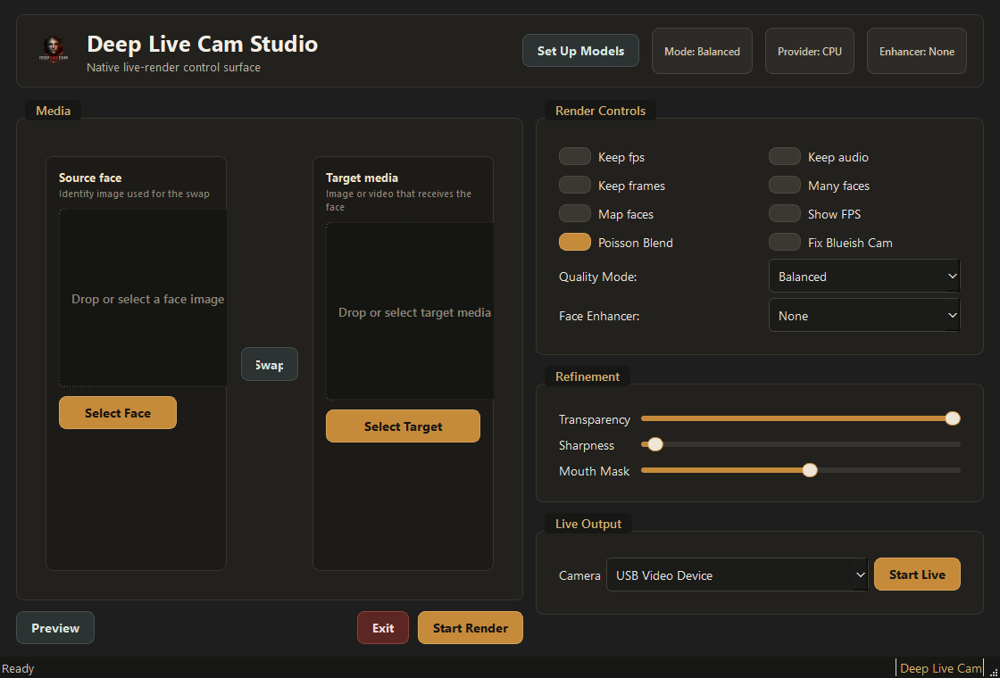
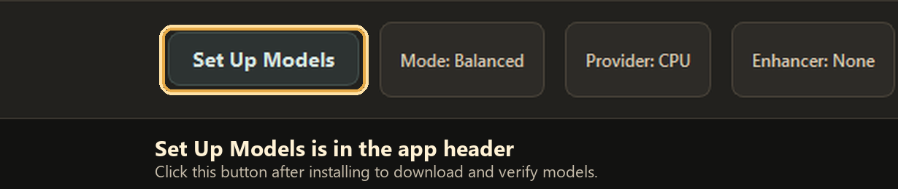
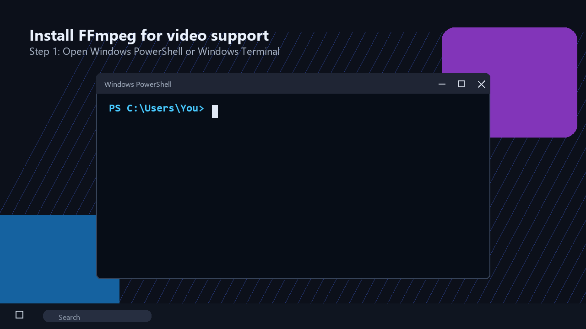

# Deep Live Cam Studio 2.1.8

Deep Live Cam Studio is a Windows-focused build of Deep-Live-Cam with a packaged desktop installer, CUDA-enabled runtime support, explicit model download/verification, OBS virtual-camera workflow support, and release compliance tooling.

This repository is the working source for the Windows Studio build published by CRSD-Lau. It is based on the upstream [hacksider/Deep-Live-Cam](https://github.com/hacksider/Deep-Live-Cam) project, with the Windows packaging and release work documented below.



## Quick Start For Windows Users

This is the normal setup path for someone who just wants to run the app:

1. Download the installer:
   [DeepLiveCamStudio-2.1.8-x64-setup.exe](https://github.com/CRSD-Lau/deep-live-cam/releases/download/v2.1.8/DeepLiveCamStudio-2.1.8-x64-setup.exe)
2. Run the installer.
3. If Windows SmartScreen appears, choose **More info** and then **Run anyway** only if the installer came from the release link above.
4. Open **Deep Live Cam Studio** from the Windows Start Menu.
5. Click **Set Up Models** in the app header and follow the prompts.

That is enough for the installed app and required face-swap model setup.

Model setup is built into the Studio window. You do not need to search Windows for a separate model downloader shortcut.



For video files, `ffmpeg` and `ffprobe` are also needed. Install them with:

```powershell
winget install Gyan.FFmpeg
```



Then close and reopen Deep Live Cam Studio. OBS Virtual Camera is optional and only needed if you want to send the live output into Discord, Zoom, Teams, OBS, or similar apps.

## What The Installer Includes

Included:

- Deep Live Cam Studio desktop app.
- Start Menu shortcut for the app.
- Packaged Python runtime and app dependencies.
- CUDA 12/cuDNN 9 runtime DLLs for NVIDIA GPU acceleration.

Not included:

- Face-swap model/checkpoint files. Use **Set Up Models** in the app after install.
- `ffmpeg` and `ffprobe`, which are needed for video-file processing and audio restore.
- OBS Virtual Camera, which is optional.

## Download The App

If you only want to install Deep Live Cam Studio, do not use the green **Code** button. The source `.zip` files are for developers. Download the Windows installer from the latest GitHub Release:

[Download DeepLiveCamStudio-2.1.8-x64-setup.exe](https://github.com/CRSD-Lau/deep-live-cam/releases/download/v2.1.8/DeepLiveCamStudio-2.1.8-x64-setup.exe)

Or open the full release page:

[Deep Live Cam Studio 2.1.8 release](https://github.com/CRSD-Lau/deep-live-cam/releases/tag/v2.1.8)

On the release page, expand **Assets** and choose:

```text
DeepLiveCamStudio-2.1.8-x64-setup.exe
```

Run the installer after it downloads. Windows may show a Microsoft Defender SmartScreen warning because the public installer is not signed by a paid code-signing certificate. Choose **More info** and then **Run anyway** only if you downloaded it from the release link above.

After installing, launch **Deep Live Cam Studio** from the Start Menu. The app installs here by default:

```text
%LOCALAPPDATA%\Programs\DeepLiveCamStudio\2.1.8
```

The installer does not include model/checkpoint files. After first install, open **Deep Live Cam Studio** and click **Set Up Models** in the app header. If you prefer the terminal, open one in the installed app folder and run:

```powershell
DeepLiveCamStudioCLI.exe --download-models
```

The downloader shows model sources, license notes, and checksums before installing model files.

## What We Added

- Windows x64 per-user installer built with PyInstaller and Inno Setup.
- Versioned install path under `%LOCALAPPDATA%\Programs\DeepLiveCamStudio\<version>`.
- Desktop/Start Menu app launcher for `DeepLiveCamStudio.exe`.
- Separate CLI entry point, `DeepLiveCamStudioCLI.exe`, for diagnostics, model setup, and batch processing.
- In-app **Set Up Models** flow with source URLs, license notes, and SHA-256 checks before download.
- User model storage under `%LOCALAPPDATA%\DeepLiveCamStudio\models`, preserved during uninstall.
- CUDA 12/cuDNN 9 runtime DLL bundling for `onnxruntime-gpu` in packaged Windows builds.
- Startup DLL registration for frozen PyInstaller installs so CUDA sessions load correctly.
- OBS Virtual Camera and direct virtual-camera workflow documentation.
- Packaged runtime, installer, clean-VM, OBS, and release-artifact verification scripts.
- Windows bundle manifest and third-party license evidence for release review.
- Optional Authenticode signing support and local self-signing support for test builds.

## Latest Release

Current release page:

[Deep Live Cam Studio 2.1.8](https://github.com/CRSD-Lau/deep-live-cam/releases/tag/v2.1.8)

What changed in 2.1.8:

- Fixed **Start Live** so it sends frames to OBS Virtual Camera instead of only opening the preview window.
- Fixed **Exit** so the Studio button stops child windows, cleans up, and closes the app reliably.
- Refined the Studio media controls and removed the unreliable Random face action.
- Fixed the default window size at 1500x900 so the app opens in the intended layout and can only grow by maximizing.
- Matched the Source Face and Target Media action buttons to the drop-zone width.
- Refreshed the runtime dependency pins after a security review.

Direct installer download:

[DeepLiveCamStudio-2.1.8-x64-setup.exe](https://github.com/CRSD-Lau/deep-live-cam/releases/download/v2.1.8/DeepLiveCamStudio-2.1.8-x64-setup.exe)

The release asset name is:

```text
DeepLiveCamStudio-2.1.8-x64-setup.exe
```

## Install And Update

Install the latest release by downloading and running `DeepLiveCamStudio-2.1.8-x64-setup.exe` from the GitHub Release page.

Default install path:

```text
%LOCALAPPDATA%\Programs\DeepLiveCamStudio\2.1.8
```

Model storage:

```text
%LOCALAPPDATA%\DeepLiveCamStudio\models
```

Updates install into a new versioned folder. You do not need to uninstall the previous version first. Once the new version is working, you can remove older versions from Windows Installed Apps.

## Windows Runtime Notes

- CUDA acceleration requires compatible NVIDIA drivers.
- The Windows installer bundles the CUDA 12/cuDNN 9 runtime DLLs needed by `onnxruntime-gpu`.
- If CUDA is unavailable, the app can fall back to CPU or DirectML where supported.
- `ffmpeg` and `ffprobe` are required for video processing and audio restore. They are not bundled by default.
- OBS Virtual Camera is optional and must be installed/configured through OBS.
- Desktop launch logs are written to `%LOCALAPPDATA%\DeepLiveCamStudio\logs`.
- UI switch state is written to `%LOCALAPPDATA%\DeepLiveCamStudio\switch_states.json`.

## Model Setup

From an installed build:

From the installed app, click **Set Up Models** in the header. For terminal setup, open a shell in the installed app folder and run:

```powershell
DeepLiveCamStudioCLI.exe --download-models
```

From a source checkout:

```powershell
python run.py --download-models
```

Use `DLC_MODELS_DIR` to point the app at a different reviewed model folder.

Do not upload model binaries to GitHub Releases unless redistribution rights are confirmed for each model file.

## Usage

Launch the desktop app from the Start Menu or installed folder.

For CLI processing:

```powershell
DeepLiveCamStudioCLI.exe --source source.png --target target.png --output output.png --execution-provider cuda
```

For source checkout usage:

```powershell
python run.py --execution-provider cuda
```

Useful CLI flags:

```text
--download-models
--execution-provider cuda
--execution-provider cpu
--execution-provider directml
--virtual-cam
--camera-width 1280
--camera-height 720
--camera-fps 60
--virtual-cam-width 1920
--virtual-cam-height 1080
--virtual-cam-fps 60
```

## OBS And Virtual Camera

Deep Live Cam Studio can send processed live output directly to a virtual camera:

```powershell
python run.py --execution-provider cuda --virtual-cam
```

Example 720p60 processing with 1080p60 virtual-camera output:

```powershell
python run.py --execution-provider cuda --virtual-cam --camera-width 1280 --camera-height 720 --camera-fps 60 --virtual-cam-width 1920 --virtual-cam-height 1080 --virtual-cam-fps 60
```

OBS's built-in virtual camera is a single device. Use direct virtual-camera output for Discord, Zoom, or Teams, or use OBS Window Capture on the `Deep-Live-Cam Live Preview` window when OBS needs to rebroadcast the scene.

See [docs/OBS_VIRTUAL_CAMERA.md](docs/OBS_VIRTUAL_CAMERA.md) for setup and troubleshooting.

## Build From Source

Recommended Windows setup:

```powershell
python -m venv venv
venv\Scripts\activate
pip install -r requirements.txt
```

For CUDA source runs:

```powershell
pip install -U torch torchvision torchaudio --index-url https://download.pytorch.org/whl/cu128
pip uninstall onnxruntime onnxruntime-gpu
pip install onnxruntime-gpu==1.23.2
python tools/check_cuda_provider.py --execution-provider cuda --strict
```

Run from source:

```powershell
python run.py --download-models
python run.py --execution-provider cuda
```

## Build The Windows Installer

Build the PyInstaller bundle:

```powershell
powershell -ExecutionPolicy Bypass -File build\windows\build_windows.ps1
```

Run local preflight checks:

```powershell
powershell -ExecutionPolicy Bypass -File build\windows\test_packaged_runtime.ps1
powershell -ExecutionPolicy Bypass -File build\windows\test_environment.ps1
```

Package the installer:

```powershell
powershell -ExecutionPolicy Bypass -File build\windows\package_installer.ps1 -AppVersion 2.1.8
```

The installer output is:

```text
build\windows\installer\DeepLiveCamStudio-2.1.8-x64-setup.exe
```

## Signing

For a real public publisher name, sign with a trusted Authenticode code-signing certificate:

```powershell
$env:DLC_SIGN_CERT_PASSWORD = "<pfx-password>"
powershell -ExecutionPolicy Bypass -File build\windows\package_installer.ps1 -AppVersion 2.1.8 -SignCertPath "C:\path\to\certificate.pfx"
```

For local-only testing without a paid certificate, self-sign and trust the certificate for the current Windows user:

```powershell
powershell -ExecutionPolicy Bypass -File build\windows\self_sign_installer.ps1 -AppVersion 2.1.8 -TrustForCurrentUser
```

Self-signing does not create public SmartScreen reputation. Other users must import and trust the exported `.cer` file themselves.

## Release Process

Run the standard local release gate:

```powershell
powershell -ExecutionPolicy Bypass -File build\windows\run_release_checks.ps1 -AppVersion 2.1.8 -GitRef <release-tag-or-commit>
```

Package corresponding source for the exact release tag or commit:

```powershell
powershell -ExecutionPolicy Bypass -File build\windows\package_source.ps1 -AppVersion 2.1.8 -GitRef <release-tag-or-commit>
```

Assemble upload assets:

```powershell
powershell -ExecutionPolicy Bypass -File build\windows\assemble_release_assets.ps1 -AppVersion 2.1.8 -RequireGitRefSource
```

The release asset set includes the installer, installer hash, source archive, source hash, source manifest, release notes, compliance evidence, `RELEASE_ASSETS.md`, and `SHA256SUMS.txt`.

## Safety And Responsible Use

Use this software responsibly and legally. If using a real person's face, obtain consent and clearly label generated output when sharing. Do not use the tool for impersonation, fraud, harassment, non-consensual sexual content, or other harmful activity.

The app includes content-safety checks, but users remain responsible for their own use.

## Upstream Attribution

This project is a modified Windows Studio build of [Deep-Live-Cam](https://github.com/hacksider/Deep-Live-Cam), which is licensed under AGPL-3.0.

Important upstream and ecosystem credits include:

- [hacksider/Deep-Live-Cam](https://github.com/hacksider/Deep-Live-Cam), the upstream application.
- [deepinsight/insightface](https://github.com/deepinsight/insightface), used for face analysis and model ecosystem support.
- [ffmpeg](https://ffmpeg.org/), used for video workflows.
- The upstream Deep-Live-Cam contributors listed in the original project history.

## License And Compliance

Deep-Live-Cam is AGPL-3.0. If you distribute a Windows installer or executable, publish the complete corresponding source for the exact binary release, including packaging scripts and modifications.

Release compliance files:

- [COMPLIANCE.md](COMPLIANCE.md)
- [THIRD_PARTY_NOTICES.md](THIRD_PARTY_NOTICES.md)
- [LICENSES/BUNDLED_BINARY_OBLIGATIONS.md](LICENSES/BUNDLED_BINARY_OBLIGATIONS.md)
- [LICENSES/MODEL_LICENSE_AUDIT.md](LICENSES/MODEL_LICENSE_AUDIT.md)
- [LICENSES/PYTHON_DEPENDENCIES.md](LICENSES/PYTHON_DEPENDENCIES.md)
- [LICENSES/WINDOWS_BUNDLE_MANIFEST.md](LICENSES/WINDOWS_BUNDLE_MANIFEST.md)

Model files have separate license and redistribution considerations. The installer excludes model/checkpoint files and requires explicit user download with visible source and license notes.
